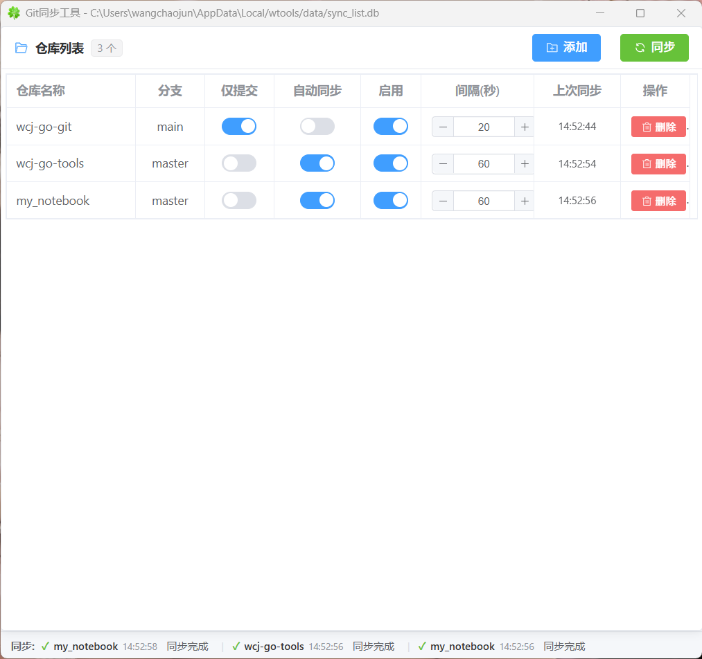

# Git同步工具

一个简洁高效的 Git 仓库同步桌面工具，支持手动同步和自动同步，适用于管理多个 Git 仓库的场景。

[English](README_en.md) | 中文

---

## 功能特性

- **多仓库管理** - 添加、删除、启用/禁用 Git 仓库，支持拖拽文件夹添加
- **一键同步** - 对多个仓库执行 `git add` → `git commit` → `git pull` → `git push` 全流程
- **自动同步** - 支持为每个仓库设置独立的自动同步间隔（最小 10 秒）
- **仅提交模式** - 支持仅提交不推送，适合内部仓库
- **同步日志** - 记录每次同步的详细信息（commit、pull、push 输出）
- **窗口状态记忆** - 自动保存窗口大小、位置和最大化状态
- **后台自动同步** - 程序启动时自动开始后台同步任务
- **单实例运行** - 防止重复启动，新实例启动时激活已有窗口
- **跨平台** - 基于 Wails 构建，支持 Windows、macOS、Linux

---

## 技术栈

| 类别 | 技术 |
|------|------|
| 框架 | [Wails v2](https://wails.io/) (Go + WebView) |
| 前端 | Vue 3 + Element Plus |
| 数据库 | SQLite |
| Git 操作 | 命令行 git |

---

## 界面预览

> 简洁的仓库列表管理界面，支持一键同步所有仓库



---

## 安装使用

### 下载发行版

前往 [Releases](https://github.com/wangchaojun/wcj-go-git/releases) 页面下载对应平台的预编译版本。

### 从源码构建

#### 环境要求

- Go 1.21+
- Node.js 18+
- npm 或 pnpm
- Git
- GCC (用于编译 SQLite)

#### 构建步骤

```bash
# 克隆项目
git clone https://github.com/wangchaojun/wcj-go-git.git
cd wcj-go-git

# 安装前端依赖
cd frontend
npm install
cd ..

# 使用 Wails 构建
wails build
```

构建产物位于 `build/bin/` 目录。

#### 开发模式

```bash
wails dev
```

---

## 配置说明

### SSH 密钥

工具默认使用 `~/.ssh/id_rsa` 作为 SSH 私钥进行 Git 操作。请确保：
- SSH 密钥已添加到 SSH Agent (`ssh-add ~/.ssh/id_rsa`)
- SSH 公钥已配置到 GitHub/Gitee 等平台

### 数据存储

- 配置文件：`{系统临时目录}/data/sync_list.db`
- 包含：仓库列表、同步日志、窗口状态

---

## 项目结构

```
wcj-go-git/
├── main.go              # 应用入口（窗口管理、单实例、DPI处理）
├── app.go               # 后端核心逻辑（Git同步、数据库操作、自动同步）
├── utils.go             # 命令行封装（git操作、URL打开等）
├── frontend/
│   └── src/
│       ├── pages/
│       │   └── gitSync.vue    # 主界面（Vue 3 + Element Plus）
│       └── wailsjs/           # Wails 生成的 JS 绑定
├── wails.json           # Wails 配置
└── go.mod               # Go 模块定义
```

---

## 使用说明

1. **添加仓库** - 点击"添加"按钮选择 Git 仓库文件夹，或直接拖拽文件夹到窗口
2. **配置仓库** - 可设置启用/禁用、自动同步、同步间隔、仅提交模式
3. **手动同步** - 点击"同步"按钮对所有已启用仓库执行同步
4. **查看结果** - 同步结果区域显示每个仓库的 commit、pull、push 日志
5. **状态栏** - 底部状态栏实时显示最新同步状态

---

## License

MIT License
