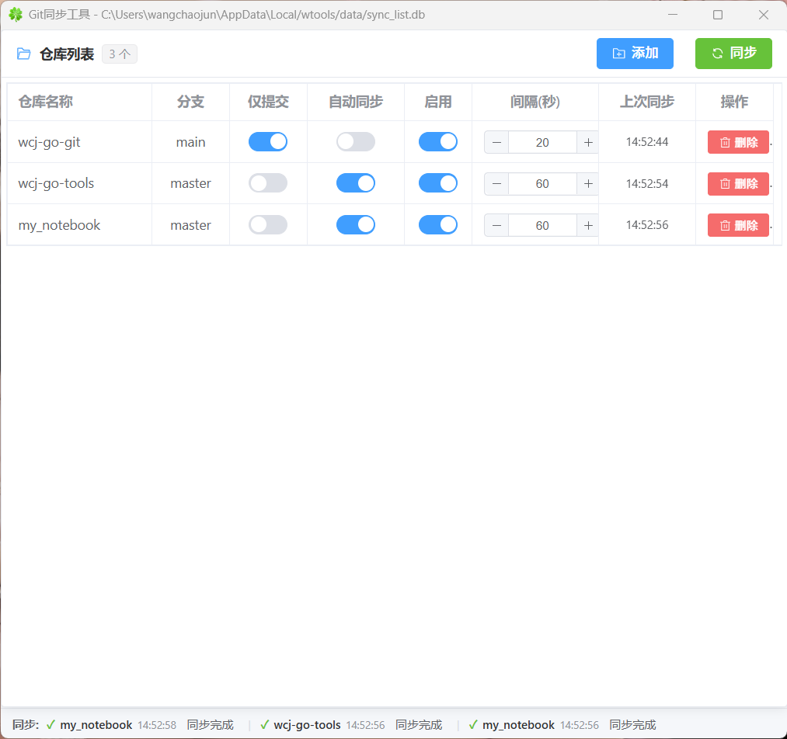

# Git同步工具

一个简洁高效的 Git 仓库同步桌面工具，支持多仓库管理、一键同步、Wails 项目打包重置等功能。

[English](README_en.md) | 中文

---

## 功能特性

- **多仓库管理** - 添加、删除、启用/禁用 Git 仓库
- **一键同步** - 对多个仓库执行 `git add` → `git commit` → `git pull` → `git push` 全流程
- **自动同步** - 支持为每个仓库设置独立的自动同步间隔（每分钟至每天）
- **仅提交模式** - 支持仅提交不推送，适合内部仓库
- **同步日志** - 记录每次同步的详细信息（commit、pull、push 输出）
- **重置项目** - 删除 .git 并重新初始化，保留原分支和远程地址
- **打包项目** - 对 Wails 项目执行 `wails build`，自动复制 exe 到指定目录
- **窗口状态记忆** - 自动保存窗口大小、位置和最大化状态
- **单实例运行** - 防止重复启动，新实例启动时激活已有窗口
- **跨平台** - 基于 Wails 构建，支持 Windows、macOS、Linux

---

## 技术栈

| 类别 | 技术 |
|------|------|
| 框架 | [Wails v2](https://wails.io/) (Go + WebView) |
| 前端 | Vue 3 + Element Plus |
| 数据库 | SQLite |
| Git 操作 | 命令行 git |

---

## 界面预览

> 简洁的仓库列表管理界面，支持一键同步所有仓库



---

## 安装使用

### 下载发行版

前往 [Releases](https://github.com/wangchaojun/wcj-go-git/releases) 页面下载对应平台的预编译版本。

### 从源码构建

#### 环境要求

- Go 1.21+
- Node.js 18+
- npm 或 pnpm
- Git
- Wails CLI (`go install github.com/wailsapp/wails/v2/cmd/wails@latest`)

#### 构建步骤

```bash
# 克隆项目
git clone https://github.com/wangchaojun/wcj-go-git.git
cd wcj-go-git

# 安装前端依赖
cd frontend
npm install
cd ..

# 使用 Wails 构建
wails build
```

构建产物位于 `build/bin/` 目录。

#### 开发模式

```bash
wails dev
```

---

## 配置说明

### SSH 密钥

工具默认使用 `~/.ssh/id_rsa` 作为 SSH 私钥进行 Git 操作。请确保：
- SSH 密钥已添加到 SSH Agent (`ssh-add ~/.ssh/id_rsa`)
- SSH 公钥已配置到 GitHub/Gitee 等平台

### 数据存储

- 配置数据库（由后台服务独占）：`{用户缓存目录}/wtools/data/sync_list.db`（Windows 下为 `%LOCALAPPDATA%\wtools\data\sync_list.db`），包含仓库列表、同步日志、配置
- UI 状态文件（由界面进程独占）：`{用户缓存目录}/wtools/ui_state.json`，包含窗口大小、位置、最大化状态

### 后台同步服务

- `sync.exe` 是数据库的**唯一访问入口**：建表、迁移、仓库列表、同步日志、配置读写全部由它完成
- 界面进程不直接读写数据库，所有数据操作通过 HTTP 接口（`127.0.0.1:19090`，仅本机可访问）代理到后台服务
- 接口列表：`/sync`（手动同步）、`/repos/list`、`/repos/save`、`/logs`、`/fingerprint`（数据变化检测）、`/config/get|set|delete`、`/refresh`
- 界面点击"同步"或首次启动时会自动拉起同目录下的 `sync.exe`，无需手动运行（请保证两个 exe 在同一目录）
- 数据变化由界面进程轮询指纹接口检测，变化时通过 Wails 事件推送给前端渲染

### 打包输出目录

打包后的 exe 文件会自动复制到：`E:\application\我的工具箱`

---

## 项目结构

```
wcj-go-git/
├── main.go              # 应用入口（窗口管理、单实例、DPI处理）
├── app.go               # 界面后端（数据经 HTTP 代理到 sync 服务、窗口状态 JSON、重置、打包）
├── utils.go             # 命令行封装（URL 打开等）
├── types/               # GUI 与 sync 服务共享的数据结构与接口约定
├── gitcmd/              # 带真实退出码的命令执行封装（隐藏窗口复用 common）
├── frontend/
│   └── src/
│       ├── pages/
│       │   └── gitSync.vue    # 主界面（Vue 3 + Element Plus 按需导入）
│       └── wailsjs/           # Wails 生成的 JS 绑定
├── sync/
│   ├── main.go          # 后台服务：数据库唯一属主（建表/迁移、数据接口、自动同步）
│   └── main_test.go     # 数据层单元测试（隔离目录，不触碰真实数据）
├── wails.json           # Wails 配置
└── go.mod               # Go 模块定义
```

---

## 使用说明

### 仓库管理

1. **添加仓库** - 点击"添加"按钮选择 Git 仓库文件夹
2. **启用/禁用** - 开关控制仓库是否参与同步
3. **删除仓库** - 从列表中移除仓库（不影响实际仓库）
4. **自动同步** - 开启后自动按间隔同步
5. **仅提交** - 只执行 commit 不执行 push

### 同步操作

1. **手动同步** - 点击"同步"按钮对所有已启用仓库执行同步
2. **查看结果** - 同步结果区域显示每个仓库的 commit、pull、push 日志
3. **状态栏** - 底部状态栏实时显示最新同步状态

### 重置项目

点击"重置"按钮会：
1. 删除仓库的 `.git` 目录
2. 重新初始化 (`git init`)
3. 添加所有文件 (`git add .`)
4. 提交 (`git commit -m "基本功能实现V1.0"`)
5. 重新设置远程地址
6. 强制推送到远程

> 注意：重置前会检测原分支名和远程地址，确保保持一致

### 打包项目

点击"打包"按钮会：
1. 在仓库目录执行 `wails build`
2. 查找生成的 exe 文件
3. 自动复制到 `E:\application\我的工具箱` 目录

> 注意：必须是 Wails 项目目录（有 wails.json）

---

## License

MIT License
